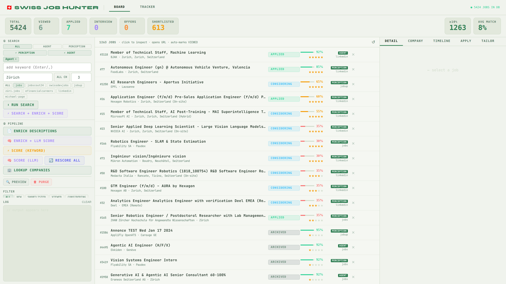
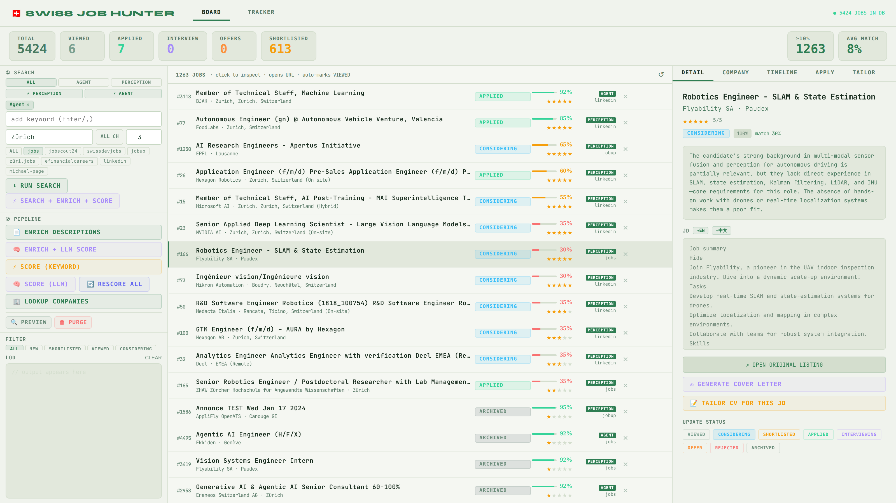
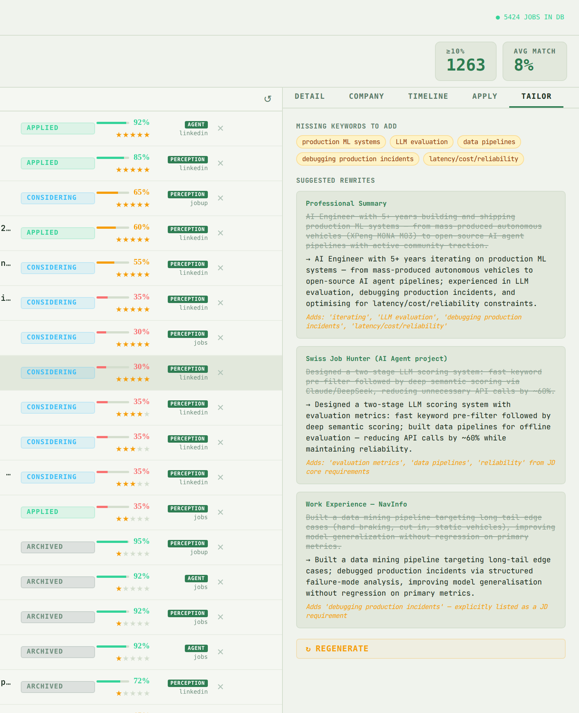
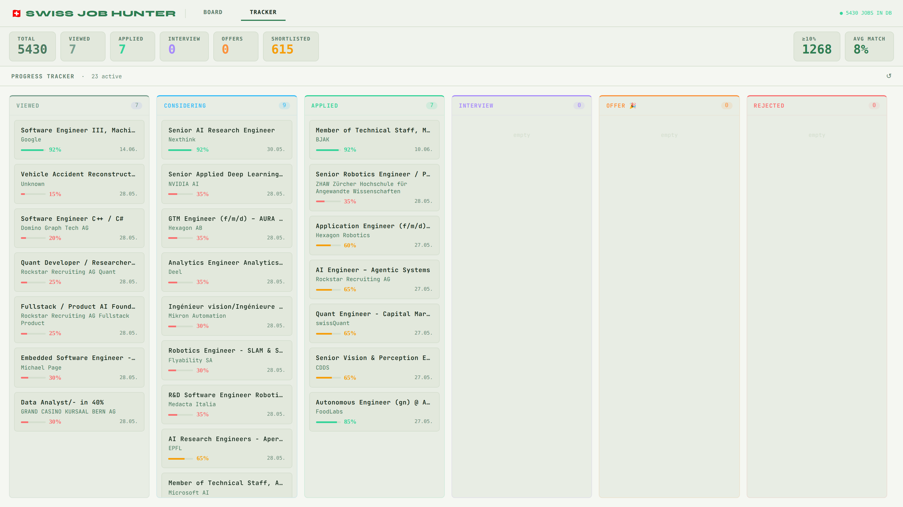

<div align="center">

# 🇨🇭 Swiss Job Hunter

**Automated job search, scoring, and application tracking — built for Switzerland, adaptable to any country**

[](https://eurojobhunter.com)
[](https://www.python.org)
[](LICENSE)

[Features](#features) · [Quick Start](#quick-start) · [UI](#ui) · [Multi-Direction](#multi-direction-search) · [Architecture](#architecture) · [Use it anywhere](#use-it-anywhere) · [🚀 Try it hosted, free](https://eurojobhunter.com)

<video src="https://github.com/user-attachments/assets/7931b4e7-3125-4bed-aeba-bbb13644e31e" controls width="100%"></video>

</div>

---

## Why

Job searching in Switzerland is fragmented — the same listing appears on jobs.ch, LinkedIn, JobScout24, and several other platforms simultaneously. You end up manually deduplicating, copy-pasting cover letters, and losing track of what you applied to.

Swiss Job Hunter automates the boring parts:
- Scrapes 8 Swiss job boards and deduplicates across sources
- Scores each job against your CV (fast keyword match + LLM deep analysis)
- Generates tailored cover letters via Claude / DeepSeek / OpenRouter
- Tracks every application with a Kanban board and event timeline
- Supports multiple job directions (e.g. Agent Engineer + Perception Engineer) with separate CVs

---

## Roadmap & Feedback

### 🚀 Latest

- **Jul 2026** — Interview management system — resume version library, per-round interview tracking with retrospectives, a STAR story library, and cross-job question search, on top of the existing application tracker
- **Jul 2026** — 🚀 **[eurojobhunter.com](https://eurojobhunter.com) is live** — the hosted version of this project, no Docker, no API keys, 100% free to use (scan, score, triage, track, get notified)
- **Jul 2026** — Guided onboarding, daily automated scans, and Telegram/email alerts the moment a strong match appears
- **Jun 2026** — Multi-user scheduler and AES-encrypted CV storage shipped, laying the groundwork for the hosted version

### 🔭 What's next

- More European job boards beyond Switzerland (DACH + EU expansion)

👉 **[Share feedback — help shape what gets built next](https://tally.so/r/0QG5L0)**

---

## Use it anywhere

Despite the name, the architecture is **country-agnostic**. The scrapers are the only Switzerland-specific layer — everything else (dedup, LLM scoring, CV tailoring, cover letters, Kanban tracker) works unchanged for any job market.

To adapt it for your country:

1. **Add scrapers** for local boards — see [Adapting to Your Country](#adapting-to-your-country)
2. **Update the source list** in `ui/src/App.jsx` (`SOURCES` constant)
3. **Drop in your CV** as `data/cv.txt` (or `data/cv_{direction}.txt` for multiple roles)

That's it. Contributions of new country scrapers are very welcome — open a PR!

> **Germany?** A hosted version targeting DACH + EU job boards is live: [EuroJobHunter](https://eurojobhunter.com)

---

## Features

| | Feature |
|---|---|
| ⬇ | **Multi-source scraping** — 8 Swiss job boards, httpx + Playwright; search Switzerland-wide or by city |
| 🔁 | **Smart deduplication** — SHA-256 exact match + MiniLM semantic similarity |
| 📄 | **Full JD enrichment** — fetches complete descriptions beyond preview snippets |
| ⭐ | **CV matching** — two-stage scoring: dynamic keyword pre-filter (LLM-extracted from CV, cached) then full LLM deep analysis; irrelevant jobs are archived before consuming tokens |
| 🎯 | **Direction tagging** — auto-detected from `data/cv_*.txt` files; each direction uses its own CV and keyword cache |
| ⚡ | **Keyword presets** — one-click preset groups per direction (e.g. PERCEPTION loads `computer vision engineer`, `ADAS engineer`, `sensor fusion engineer`, etc.) |
| 🔖 | **Batch keyword search** — tag-based input; type a keyword and press Enter or comma to add, Backspace to remove; all keywords searched in sequence across selected sources |
| 🚀 | **One-click pipeline** — SEARCH + ENRICH + SCORE chains all three steps automatically, with LinkedIn cooldown between keywords |
| 🏢 | **Company lookup** — LLM-generated company summaries, cached per company |
| 📝 | **CV tailoring** — per-JD rewrite suggestions with ATS keyword gap analysis; heuristic JD section extraction strips boilerplate before passing to LLM |
| ✍ | **Cover letter generation** — personalized EN/DE letters via Claude API |
| 🌐 | **Description translation** — translate JDs to English on demand |
| 📋 | **Kanban tracker** — NEW → Viewed → Considering → Applied → Interview → Offer |
| 🕐 | **Timeline** — per-job event log (recruiter calls, interviews, offers, rejections) |
| ★ | **Star rating** — manual 1–5 star interest rating per job, filterable in the board |
| 🔢 | **Score threshold filter** — show and count only jobs at or above a match-score percentage |
| 🗑 | **Bulk purge** — preview and delete low-scoring jobs by threshold |
| ⌨ | **CLI** — full terminal interface for power users |

---

## Quick Start

### Prerequisites
- Python 3.11+
- Node.js 18+
- At least one LLM API key: [Anthropic](https://console.anthropic.com), [DeepSeek](https://platform.deepseek.com), or [OpenRouter](https://openrouter.ai/keys)
- Or use Ollama!

### 1. Clone & install

```bash
git clone https://github.com/Donvink/swiss-job-hunter.git
cd swiss-job-hunter

pip install -r requirements.txt
playwright install chromium

cd ui && npm install && cd ..
```

### 2. Configure

```bash
cp .env.example .env
```

Edit `.env`:

```bash
ANTHROPIC_API_KEY=sk-ant-...   # Claude (cover letters, LLM scoring, company lookup)
DEEPSEEK_API_KEY=sk-...        # DeepSeek — cheaper alternative
OPENROUTER_API_KEY=sk-or-...   # OpenRouter — access 100+ models via one key
OPENROUTER_MODEL=openai/gpt-4o-mini  # any model slug from openrouter.ai/models
OLLAMA_BASE_URL=http://localhost:11434/v1
OLLAMA_MODEL=qwen3.6:latest
LLM_PROVIDER=auto              # auto | anthropic | deepseek | openrouter | ollama
```

> **LLM routing** — `auto` round-robins between every provider whose key is set.
> Pin to a single provider with `LLM_PROVIDER=openrouter` (or `anthropic` / `deepseek`).
> Only one key is required; all four can coexist.

### 3. Add your CV

Place one or more CV text files in `data/` using the naming convention `cv_{direction}.txt`.
Each file defines a search direction; the backend auto-detects them at startup.

```bash
# Single direction
cp your_cv.txt data/cv_agent.txt

# Multiple directions (different roles → different CVs)
cp your_agent_cv.txt      data/cv_agent.txt
cp your_perception_cv.txt data/cv_perception.txt
```

The `data/cv.txt` file is used as a fallback when no direction is specified.

### 4. Start

```bash
# Terminal 1 — backend
python server.py

# Terminal 2 — frontend
cd ui && npm run dev
```

Open **http://localhost:5173**

---

## Docker

Bring up the whole stack (backend API + static frontend) with one command — no local Python, Node, or Playwright setup required.

```bash
# 1. Configure: copy the template and add at least one LLM key
cp .env.example .env
#    edit .env → set ANTHROPIC_API_KEY / DEEPSEEK_API_KEY / OPENROUTER_API_KEY

# 2. Add your CV (the data/ directory is bind-mounted into the backend)
cp your_cv.txt data/cv.txt

# 3. Build and start
docker compose up -d --build
```

- **UI** → http://localhost:5173
- **API** → http://localhost:8765

The compose stack runs both the backend and the frontend with one command.

```bash
docker compose logs -f backend   # follow backend logs
docker compose down              # stop (data and model cache persist)
```

**Remote deploys.** The browser calls the backend directly, so the frontend container needs to know the backend's real address. Set `VITE_API_BASE_URL` in `.env` (e.g. `VITE_API_BASE_URL=https://your-tailscale-ip:8765`) — the container reads it at **startup**, so this works whether you build locally or pull the pre-built image from GHCR; no rebuild required. It defaults to `http://localhost:8765`. This is useful if you want to run this on an always-on server (e.g. a NAS) and access it over Tailscale or your LAN.

---

## UI

The sidebar guides you through the full pipeline:

```
① SEARCH → ② PIPELINE (Enrich → Score → Company Lookup → Purge) → FILTER → LOG
```

**① SEARCH**

Pick a direction (ALL / AGENT / PERCEPTION / …), then choose keywords and sources.

- **Keyword presets** — click **⚡ PERCEPTION** or **⚡ AGENT** to instantly load a curated keyword group and switch to the matching direction:
  - **PERCEPTION**: `computer vision engineer`, `ADAS engineer`, `sensor fusion engineer`, `autonomous driving engineer`, `robotics engineer`, `perception engineer`, `SLAM engineer`, `robot perception engineer`, `motion planning engineer`, `autonomous systems engineer`, `robotics software engineer`
  - **AGENT**: `machine learning engineer`, `AI engineer`, `deep learning engineer`, `LLM Application Engineer`, `agentic AI`, `GenAI engineer`, `MLOps engineer`, `AI software engineer`, `applied scientist`
- **Batch keywords** — type a keyword and press **Enter** or **,** (comma) to add it as a tag; press **Backspace** to remove the last one. All keywords are searched in sequence across every selected source.
- **Location** — leave blank for all Switzerland, or type a city. **ALL CH** button clears it.
- **Pages** — number of pages to fetch per source per keyword.
- **Sources** — toggle individual boards or use **ALL**.

When **LinkedIn** is selected, two extra dropdowns appear:
- **Time range** — 24h / 7 days / 30 days
- **Experience level** — Entry–Senior / Associate–Senior (default) / Senior only / Senior–Director

**RUN SEARCH** scrapes only. **⚡ SEARCH + ENRICH + SCORE** runs the full pipeline in one click:
1. Search all keywords across selected sources (with automatic 5s LinkedIn cooldown between keywords)
2. Enrich descriptions for every source
3. LLM score all enriched jobs

The pipeline button is protected against double-clicks — a second click while running logs `✗ Pipeline already running` and is ignored.

**② PIPELINE**
- **ENRICH DESCRIPTIONS** — fetches full JDs for jobs that only have a preview snippet
- **ENRICH + LLM SCORE** — enriches then immediately scores with LLM in one step
- **SCORE (KEYWORD)** — fast keyword match against your CV, no API cost
- **SCORE (LLM)** — two-stage: keyword pre-filter first (skills extracted from your CV, cached to `data/cv_keywords_{direction}.json`); jobs below the threshold are archived without an LLM call, the rest get full deep analysis via Claude/DeepSeek
- **LOOKUP COMPANIES** — generates a short LLM summary for each company, cached
- **PREVIEW / PURGE** — dry-run or delete scored jobs below a score threshold

**FILTER** — filter by status (NEW / SHORTLISTED / VIEWED / CONSIDERING / APPLIED / …), minimum star rating (★–★★★★★), minimum match score (≥ N%), and free-text search

**LOG** — live SSE output from every pipeline operation; shows a pulsing **●** indicator while any operation is running, and per-source progress every 10 jobs fetched

**BOARD** — job list with score bars, status badges, direction tags, and star ratings; click a job to open its detail panel with tabs:
- **DETAIL** — full JD, match score, translate button; click **TAILOR CV FOR THIS JD** to run ATS analysis
- **COMPANY** — LLM-generated company summary (cached)
- **TIMELINE** — per-job event log with manual note entry
- **APPLY** — cover letter generation and email application
- **TAILOR** — missing keywords (chips) + per-bullet rewrite suggestions (original → improved + reason); **REGENERATE** reruns the analysis

**TRACKER** — Kanban board across all application stages

### Screenshots

| Job Board | Job Detail & CV Tailoring |
|---|---|
|  |  |

| CV Tailoring — ATS Suggestions | Application Tracker |
|---|---|
|  |  |

---

## Application Statuses

| Status | Meaning |
|---|---|
| NEW | Just scraped, not yet reviewed |
| ANALYZED | Keyword-scored, awaiting LLM scoring |
| SHORTLISTED | Scored above threshold |
| VIEWED | JD opened in the UI |
| CONSIDERING | Read the JD, interested but not ready to apply |
| APPLIED | Application sent |
| INTERVIEWING | In interview process |
| OFFER | Offer received |
| REJECTED | Rejected |
| ARCHIVED | Filtered out (low score or manual) |

---

## Multi-Direction Search

Target multiple job types with separate CVs — directions are auto-detected from files in `data/`:

```bash
# Filename convention: data/cv_{direction}.txt
cp your_agent_cv.txt      data/cv_agent.txt
cp your_perception_cv.txt data/cv_perception.txt
```

Restart the backend and the new directions appear automatically in the UI dropdown. The system:
- Tags scraped jobs with the active direction
- Loads the matching CV automatically when scoring or generating cover letters
- Lets you filter the job list by direction
- Uses direction-specific keyword caches for the pre-filter

The **⚡ preset buttons** are mapped to directions by name — adding a `cv_perception.txt` file automatically makes the PERCEPTION preset available.

Add as many directions as you like. The `data/cv.txt` file is used as a fallback in ALL mode.

---

## CLI

```bash
# Scrape jobs
sjh search "AI Agent engineer" --location "Zürich" --source jobs.ch

# Enrich with full descriptions
sjh enrich --source jobs.ch

# Score against your CV
sjh analyze                    # keyword scoring (fast)
sjh analyze --llm              # LLM scoring (accurate)

# View top matches
sjh top --limit 20

# Generate cover letter
sjh cover <job_id> --lang en

# Daily summary
sjh digest
```

---

## Supported Job Boards

| Source | Method | Notes |
|---|---|---|
| jobs.ch | JSON API + HTML detail | Primary Swiss board |
| jobscout24.ch | JSON API | Large Swiss generalist board |
| jobup.ch | JSON API + HTML detail | French-speaking Switzerland |
| swissdevjobs.ch | HTML / BS4 | IT & software focused |
| züri.jobs | JSON-LD + HTML | Zürich-focused |
| efinancialcareers.ch | JSON + HTML | Finance & banking |
| linkedin.com | HTTP guest API | No login required; set `LINKEDIN_COOKIE` for more results; experience level filter (`f_E`) configurable in UI |
| michael-page.ch | HTML / BS4 | Executive & specialist roles |
| indeed.ch | Playwright | JS-rendered; requires Chromium |

---

## Architecture


### Tech Stack

| Layer | Tech |
|---|---|
| Scraping | `httpx`, `playwright`, `beautifulsoup4` |
| Dedup | SHA-256 + `sentence-transformers` (MiniLM-L6) |
| Storage | SQLite + SQLAlchemy 2.x |
| LLM | Anthropic Claude, DeepSeek, OpenRouter (OpenAI-compatible) |
| Backend | FastAPI + SSE streaming |
| Frontend | React 18 + Vite |
| CLI | Typer + Rich |

---

## Adapting to Your Country

The scraper layer is the only country-specific part. Here's what to change:

### 1. Add a scraper

Create `scrapers/my_board.py` extending `BaseScraper`:

```python
class MyBoardScraper(BaseScraper):
    source_name = "myboard.de"          # shown in UI and stored in DB

    async def scrape(self, keyword, location, max_pages):
        # httpx / Playwright — yield ScrapedJob instances
        async with httpx.AsyncClient() as client:
            r = await client.get(
                "https://myboard.de/jobs",
                params={"q": keyword, "l": location},
            )
            for item in r.json()["results"]:
                yield ScrapedJob(
                    title=item["title"],
                    company=item["company"],
                    location=item["location"],
                    url=item["url"],
                    description=item.get("snippet", ""),
                    source=self.source_name,
                )
```

Register it in `scrapers/__init__.py` → `SCRAPER_REGISTRY`.

### 2. Update the UI source list

In `ui/src/App.jsx`, add the new board to the `SOURCES` constant so it appears as a toggle button.

### 3. Test

```bash
sjh search "software engineer" --location "Berlin" --source myboard.de
```

That's all. Open a PR to share your scraper with other users in your country!

---

## WSL / Windows Notes

If running on WSL with a Windows browser, add to `~/.wslconfig`:

```ini
[wsl2]
networkingMode=mirrored
```

Then `wsl --shutdown` and restart.

---

## Responsible Scraping

- Random delays between requests (1.5–4s)
- Retry with exponential backoff
- Automatic 5s cooldown between keywords when LinkedIn is included
- Respects rate limits — do not set `SCRAPER_DELAY_MIN` below 1.0

---

## License

AGPL-3.0 © [Leo Zhong](https://github.com/Donvink)

If you use this code to provide a hosted service, you must release your modifications under the same license. For commercial use without open-sourcing your modifications, contact the author for a commercial license.

---

## Star History

<a href="https://www.star-history.com/?type=date&repos=Donvink%2Fswiss-job-hunter">
 <picture>
   <source media="(prefers-color-scheme: dark)" srcset="https://api.star-history.com/chart?repos=Donvink/swiss-job-hunter&type=date&theme=dark&legend=top-left&sealed_token=XixnC4iv5p1ZD2fZAAQg4e-NVqxU4xkVv6p0leCAJQupv8p66Z-nWqh5I5IULKXWCW6kPHL5U5IIWcolkNz3BvwBeoLy8KDQ51e-JjgzDSG9IfjpaDmamaPFzKhD2XZFOmRWi9_Eu8n_0Zboxw2Dod-H9Ao1rOJWK5mxQVQ0PC6E14j85Zspa6_dJ6VH" />
   <source media="(prefers-color-scheme: light)" srcset="https://api.star-history.com/chart?repos=Donvink/swiss-job-hunter&type=date&legend=top-left&sealed_token=XixnC4iv5p1ZD2fZAAQg4e-NVqxU4xkVv6p0leCAJQupv8p66Z-nWqh5I5IULKXWCW6kPHL5U5IIWcolkNz3BvwBeoLy8KDQ51e-JjgzDSG9IfjpaDmamaPFzKhD2XZFOmRWi9_Eu8n_0Zboxw2Dod-H9Ao1rOJWK5mxQVQ0PC6E14j85Zspa6_dJ6VH" />
   
 </picture>
</a>

---

<div align="center">
<sub>Started in Switzerland · built for job seekers everywhere · Contributions welcome</sub>
</div>
